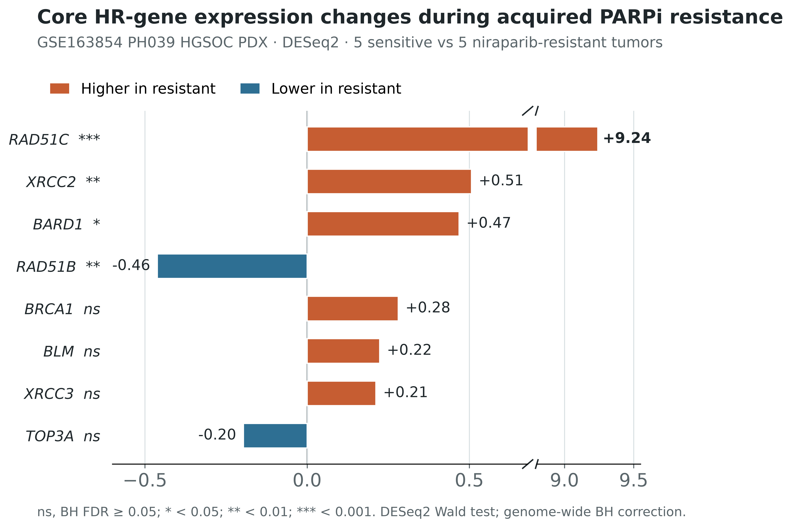

# GSE163854 PARPi-resistance analysis

Reproducible RNA-seq analysis of DNA-repair and homologous-recombination (HR)
gene-expression changes during acquired niraparib resistance in the PH039
high-grade serous ovarian cancer (HGSOC) patient-derived xenograft (PDX) model.

## Analysis design

- Data source: NCBI GEO [GSE163854](https://www.ncbi.nlm.nih.gov/geo/query/acc.cgi?acc=GSE163854)
- Sensitive tumors: `P2A1`, `P2A2`, `P2A3`, `F1A3`, `F1A4`
- Niraparib-resistant tumors: `F351`, `F352`, `F451`, `F452`, `F453`
- Mixed-response tumors `F1A5` and `F251` were excluded.
- All tumors derive from one serial PH039 PDX lineage and do not represent ten
  independent patients.

## Final figures

### Pathway-annotated heatmap


The heatmap displays 70 curated DNA-repair and replication-stress genes.
Median-ratio-normalized counts were transformed as
`log2(normalized count + 1)` and standardized within each gene across the ten
included tumors. Colors represent row Z-scores, clipped to -2.4 to +2.4.

### Core HR differential-expression analysis



Differential expression was estimated from raw counts using PyDESeq2 0.5.2.
The eight largest absolute expression changes among a defined panel of 15
BLM-BTRR/core HR genes are displayed. Statistical labels are based on
genome-wide Benjamini-Hochberg-adjusted DESeq2 Wald-test P values.

## Repository structure

```text
.
├── data/
│   └── processed/          # displayed matrices and DESeq2 result tables
├── docs/
│   ├── METHODS.md          # manuscript-ready analysis methods
│   └── REFERENCES.md       # data and software references
├── figures/                # final PNG, PDF and editable SVG files
├── scripts/
│   ├── prepare_heatmap_matrix.py
│   ├── plot_heatmap.py
│   └── run_deseq2_barplot.py
├── .gitignore
├── README.md
└── requirements.txt
```

## Reproduction

1. Download the human gene-level raw count matrix for GSE163854.
2. Save it as `data/raw/GSE163854_counts.txt.gz`. The first column must contain
   gene symbols and the sample columns must use the identifiers listed above.
3. Install the Python dependencies:

   ```bash
   python -m pip install -r requirements.txt
   ```

4. Generate the heatmap matrix and figure:

   ```bash
   python scripts/prepare_heatmap_matrix.py
   python scripts/plot_heatmap.py
   ```

5. Run the DESeq2 differential-expression analysis and generate the bar plot:

   ```bash
   python scripts/run_deseq2_barplot.py
   ```

The raw GEO count file is intentionally excluded from this repository because
it is already publicly archived. The exact processed matrices and statistical
results used for the displayed figures are committed under `data/processed/`.

## Interpretation

This analysis shows marked RAD51C re-expression in niraparib-resistant PH039
tumors. RNA-seq expression alone does not demonstrate functional restoration of
HR. The associated study provides complementary promoter-methylation and
functional evidence. Because the samples originate from one serially treated
PDX lineage, statistical results should be interpreted as model-level,
exploratory evidence rather than patient-level inference.

